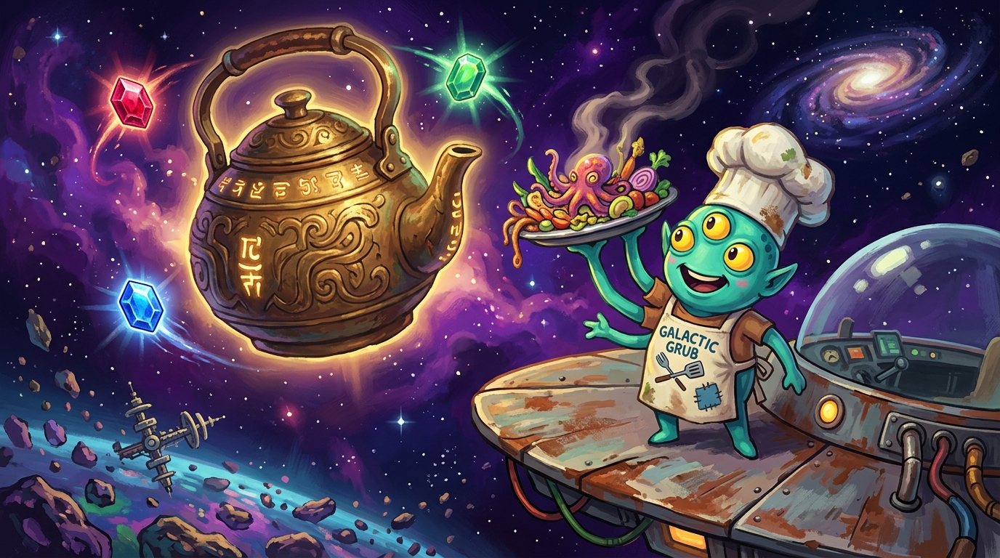

# 🛸 Starlight Supper

<p align="center">
  
</p>

*A Cosmic Culinary Odyssey — a browser-based cooking adventure.*

**📖 Read The Supper Codex** — our in-world fanzine: lore chapters, world dossiers, character deep-dives, bestiary field notes, the recipe codex, tips & tricks, and a full walkthrough:
### → [starlight.asimplenoise.com](https://starlight.asimplenoise.com)

**▶ Play now:** [game.asimplenoise.com](https://game.asimplenoise.com)

---

## 🌌 The Story

> *Three hundred years ago, the Great Kettle — the cosmic hearth that simmered the First Broth of the Cosmos — went cold. They call it the Sundering. The stars went quiet. The broth went bland.*
>
> *You are **Nimbus Quill**, last of the Vessari Gourmand Nomads. You inherit her recipes, one rustbucket ship, and a family of worms with strong opinions. Grandmother said the Kettle burned on three jewels — one on each of three worlds. She drew them on a napkin. We still have the napkin.*

Cook. Breed worms. Duel with etiquette. Rekindle the Kettle.

## ✨ Features

- 🍳 **Cosmic Cooking** — combine exotic ingredients (Starbloom Nectar, Cinderfin Fillet, Vermicelli Caviar) into dishes worth serving to discerning alien guests
- ⚔️ **Etiquette Duels** — every rival can be beaten at a tea party; win the duel of manners and they fight beside you with signature skills
- 🪱 **Worm Breeding** — run the Wormery and breed Shimmerbacks, Oracle Worms, and Philosophers whose traits shape the whole voyage
- 🌍 **Three Worlds to Explore** — Verdanth's musical moss gardens, Cinder Reach's volcanic archipelagos, Pelagia's world-ocean lit by the Deep Watch
- 💠 **A Jewel Quest** — befriend each world's champion to reveal their Jewel Vault; collect all three and Baron Volt comes for your table
- 📱 **Forklore Economy** — post your dishes to the galaxy's food-social network; fame is fuel, likes are money
- 🔁 **Day/night cycle** with energy management, HP, base building, and persistent saves
- 🎵 **Procedural chiptune soundtrack** generated live via Web Audio (best with sound on)

## 🗺️ The Three Jewels

| World | Champion | Jewel |
|---|---|---|
| 🌿 Verdanth | Madame Vex, Duchess of Rust & Roses | 🔥 Hearthstone Ruby |
| 🌋 Cinder Reach | Chef Bramble, the Exiled Flavor-Pirate | 🌪️ Gale Emerald |
| 🌊 Pelagia | Admiral Nell of the Deep Watch | 💎 Abyssal Sapphire |

Take all three — and the galaxy's grumpiest storm-food critic will demand a reservation.

## 🍽️ Signature Dishes

| Dish | Lore |
|---|---|
| 🥧 Cloudfruit Tart, Lavasalt Crust | *"Sweet as a rumor, sharp as a goodbye."* |
| 🍤 Ember-Cured Cinderfin Ceviche | *"Cooked by anger alone. Serve cold to confuse everyone."* |
| 🥩 Moonroe Wellington in Starbloom Jus | *"The dish that ended a 300-year feud on Verdanth. Twice."* |
| 🍲 **First Broth of the Cosmos** | *"Nimbus's grandmother's recipe. The Kettle remembers it."* |

## 🛠️ Tech

- Pure vanilla JavaScript + Canvas 2D — no frameworks, no build step
- ~2,300 lines across 13 modules (`js/engine.js`, `js/cooking.js`, `js/battle.js`, `js/worldmap.js`, …)
- Procedural chiptune audio (`js/audio.js`, `js/chip.js`)
- Static site + static fanzine (`codex/`) — deployable anywhere

## 🚀 Run locally

No install required:

```bash
git clone https://github.com/jrezmo/starlight-supper.git
cd starlight-supper
python3 -m http.server 8080
# open http://localhost:8080
```

The Codex lives at `codex/index.html` — serve it from any static host or open directly.

## 📁 Project structure

```
index.html        # game screens, HUD, shell
style.css         # game UI theme
js/
  engine.js       # core loop & state
  data.js         # ingredients, recipes, creatures, lore tables
  story.js        # narrative system
  cooking.js      # cooking minigame
  battle.js       # etiquette duels & combat
  world.js / worldmap.js   # expeditions & map
  hub.js          # Home Shelter base-building
  intro.js        # opening cinematic
  art.js          # canvas rendering
  chip.js / audio.js       # procedural chiptune
assets/           # character, creature & scene art
codex/            # 📖 The Supper Codex — lore & strategy fanzine site
genassets.py      # asset generation helpers
```

## 🏠 Credits

Built as part of the [asimplenoise.com](https://asimplenoise.com) personal lab. All art assets are original generated illustrations. Game design, code & lore: the Vessari Gourmand Nomads Press.

---

*Cook well. The Kettle remembers.* 🍲
